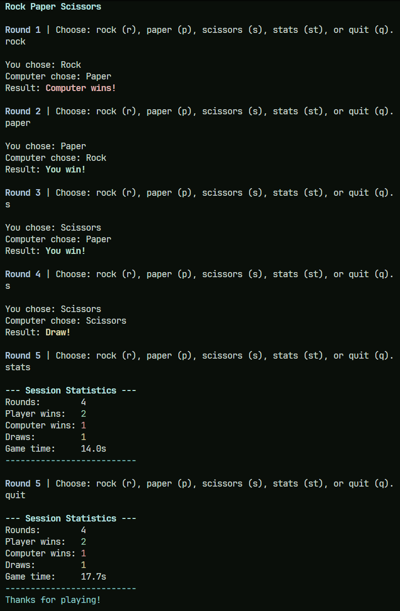

# Rock Paper Scissors

A terminal Rock Paper Scissors game implemented in Rust and TypeScript.



## Features

- Colored terminal output - external dependencies and terminal formatting
- Session statistics - state representation, data modeling, and mutation
- Elapsed time - standard-library APIs and state lifetime
- Full and shorthand commands - input parsing and interface design
- `stats` and `quit` commands - explicit control flow and application state

Persisting statistics would extend the project into filesystem I/O, serialization, and error handling.

## Run

### Rust

Requires [Rust](https://www.rust-lang.org/tools/install).

```bash
cd rust
cargo run
```

### TypeScript

Requires [Bun](https://bun.com/).

```bash
cd typescript
bun install
bun run index.ts
```
